# Fuzzification_v2

## Gabriel Teixeira Júlio

Este projeto teve como objetivo implementar um sistema fuzzy de Takagi-Sugeno de ordem zero e primeira ordem para aproximar a seguinte função não linear:

$$
f(x)=e^{−\frac{x}{5}} \cdot sin(3x) + 0.5  \cdot  sin(x)
$$

A aproximação foi realizada no intervalo $x \in [0,10]$.

## Descrição da Implementação

Para a implementação do modelo Takagi-Sugeno, utilizou-se como base o código disponibilizado em [Fuzzification](https://github.com/Kingdrasill/Fuzzification). Foram usdados os arquivos `functions.py` e `domain.py`, além da criação do arquivo `tsk_gradient_descent.py`, desenvolvido especificamente para este projeto. Neste arquivo, encontram-se as implementações do modelo Takagi-Sugeno e da otimização de seus parâmetros por Gradiente Descendente. Adicionalmente, utilizou-se também o método minimize usando BFGS da biblioteca **_Scipy_**.

### Takagi-Sugeno

O sistema fuzzy foi testado com dois modelos:

- **Takagi-Sugeno de ordem zero**
- **Takagi-Sugeno de primeira ordem**

Foi utilizada apenas uma variável linguística chamada X, que cobre o intervalo $x$ com funções de pertinência do tipo: triangular, trapezoidal, gaussiana, sino, Cauchy e Laplace. Para avaliar o desempenho do sistema, utilizou-se a métrica RMSE (Root Mean Square Error), que compara os resultados aproximados com os valores reais. Em seguida, aplicou-se o Gradiente Descendente para otimizar os parâmetros das regras do Takagi-Sugeno.

A função `Gerar_TSK` foi implementada para calcular a aproximação do modelo. Ela recebe os seguintes parâmetros:

- `x`: intervalo de valores de $[0,10]$ para os quais será realizada a aproximação.
- `entrada`: instância da classe `Domain` representando o domínio da variável de entrada.
- `paramas`: parâmetros das regras do Takagi-Sugeno.
- `tipo`: define se as regras são de ordem zero ou primeira ordem.

O cálculo é realizado iterativamente para cada valor de $x$, pegando os pesos das funções de pertinência, ponderando os valores das regras, e computando o resultado final da aproximação.

```
# Gera o resultado do método de Takagi-Sugeno de 0 ordem ou 1 ordem
def Gerar_TSK(x, entrada, params, tipo):
    # Guarda o resultado da aproximação
    y = []
    # Para cada valor de x
    for v in x:
        # Calcula os pesos da variável de entrada X
        ws = entrada.calcular_pesos(v)
        # Cada função de pertinência vai ter sua própia regra
        # Se o tipo é de 0 ordem
        if tipo == 0:
            # Para cada regra calcula: ai0
            zs = [(params[i][0]) for i in range(len(params))]
        # Se o tipo é 1 ordem
        elif tipo == 1:
            # Para cada regra calcula: ai0*x + ai1
            zs = [(params[i][0] * v + params[i][1]) for i in range(len(params))]
        # Se não for um tipo implementado
        else:
            return "Tipo de Takagi-Sugeno não existe!"
        # Calcula o numerador: Somatorio dos pesos * as regras
        numerador = sum([ws[i] * zs[i] for i in range(len(params))])
        # Calcula o denominador: Somatorio dos pesos
        denominador = sum(ws)
        # Calcula o TSK: numerador / denominador
        y.append(numerador / denominador)
    return y
```

### RMSE e Gradiente Descendente

A otimização dos parâmetros foi realizada utilizando o Gradiente Descendente, que minimiza iterativamente o erro entre a função real e a aproximada. Foram implementadas as seguintes variações:

- **Gradiente Descendete com Momento**: Acelera a convergência e reduz oscilações ao incorporar o histórico das atualizações anteriores.
- **Gradiente Descendete com Adam**: Combina momento e adaptação da taxa de aprendizado para cada parâmetro, ajustando-se dinamicamente às características do gradiente.
- **Gradiente Descendete com RMSprop**: Adapta a taxa de aprendizado com base na média dos quadrados dos gradientes, proporcionando atualizações mais estáveis.
- **Minimize BFGS**: Método quasi-Newton que minimiza uma função em várias variáveis. Utilizado diretamente da biblioteca Scipy.

A métrica de erro utilizada em todas as abordagens foi o RMSE, com um limite de tolerância de $10^{-5}$ ou, no máximo, $5000$ iterações para convergência. 

## Descrição dos Testes

Os testes realizados tiveram como objetivo avaliar a eficiência de diferentes funções de pertinência e métodos de otimização aplicados ao modelo de Takagi-Sugeno de primeira ordem. Foram analisados gráficos que exibem as funções de entrada, os valores aproximados em comparação à saída real e a evolução do erro (RMSE) ao longo das iterações. O modelo de Takagi-Sugeno de ordem zero foi descartado, pois não apresentou resultados satisfatórios em nenhum dos testes realizados.

Um ponto a ser destacado é que o método **BFGS** não calcula o RMSE no mesmo intervalo de tempo que os outros métodos. Por esse motivo, ele requer menos iterações para convergir, mas, ainda assim, é o mais demorado em geral. Isso ocorre porque o algoritmo `minimize` calcula o erro várias vezes por iteração, salvando o valor do erro sempre que ele é recalculado. Esse comportamento levou a casos em que o número de iterações registradas extrapolou o limite definido, mesmo que a otimização tenha seguido os critérios estabelecidos.

### Entrada com Funções de Pertinência Triangular

#### 4 Funções de Pertinência

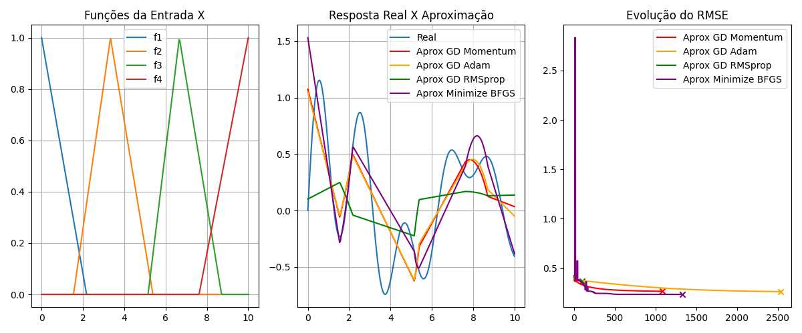

#### 5 Funções de Pertinência

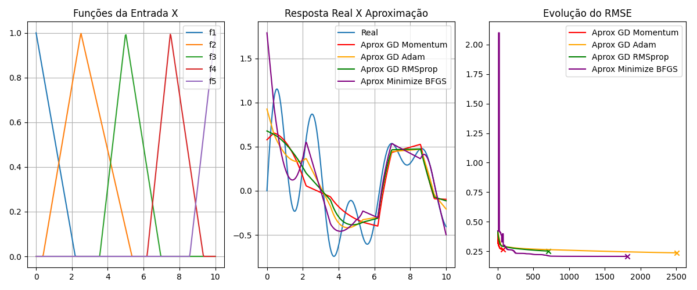


<br><br><br><br><br><br><br><br>

#### 6 Funções de Pertinência


#### 7 Funções de Pertinência

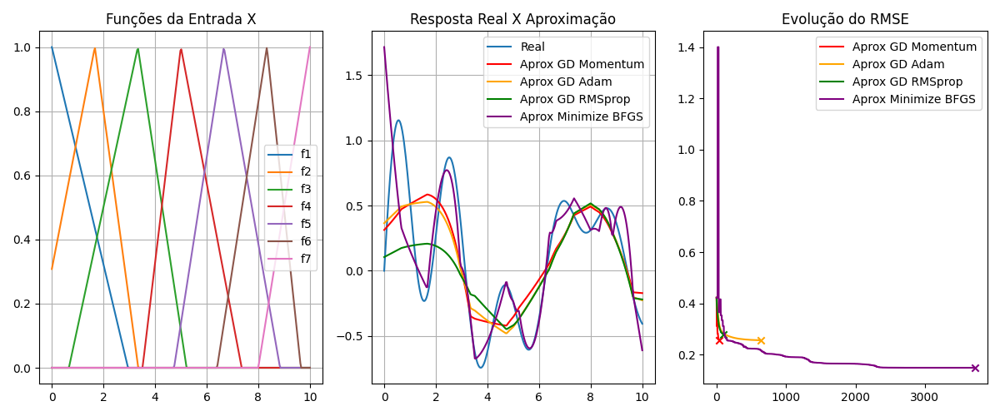

#### 8 Funções de Pertinência

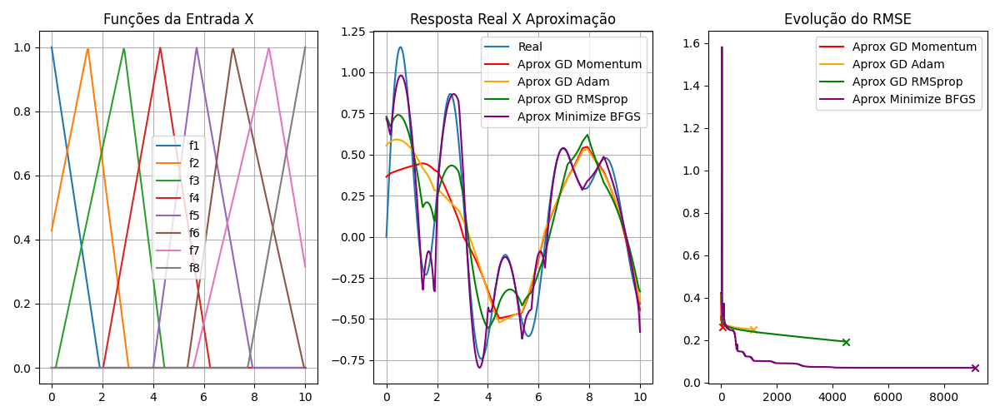

Os gráficos apresentados podem ser interpretados conforme descrito a seguir:

- **Funções de Pertinência da Entrada (à esquerda)**: Exibem as funções de pertinência utilizadas na modelagem, variando conforme o número de funções do domínio.
- **Comparação entre Aproximações e Saída Real (ao centro)**: Apresentam o desempenho do modelo em relação à função alvo, evidenciando o impacto dos métodos de otimização.
- **Evolução do RMSE (à direita)**: Mostra a evolução do erro ao longo das iterações para cada método de otimização aplicado.

**Evolução do RMSE**:

- Com o aumento no número de funções de pertinência, os valores de RMSE tendem a melhorar. No entanto, a partir de 5 funções não há mais melhorias e os erros finais não varia muito, embora alguns métodos de otimização ainda apresentem pequenos avanços pontuais.
- O método de otimização **BFGS** obtém os melhores valores de erro final e, em geral, é o mais lento para convergir. Os outros métodos apresentam erros finais semelhantes, mas há uma diferença significativa no tempo de convergência, sendo o **GD Adam** o mais demorado entre eles.

**Resposta Real X Aproximação**:

- Para 4 funções, as aproximações são razoáveis, com a melhor delas sendo a BFGS. As aproximações GD Momentum e GD Adam ficaram bastante próximas, enquanto a GD RMSprop foi a pior.
- Para 5 funções, as aproximações também são razoáveis, com a BFGS novamente se destacando. Todas as aproximações ficaram bastante próximas entre si.
- Para 6 funções, as aproximações são boas, sendo as melhores para as triangulares. A BFGS foi a melhor, mas a aproximação GD RMSprop teve um desempenho insatisfatório.
- Para 7 funções, as aproximações pioraram em comparação com o caso de 6 funções, com a BFGS sendo a melhor. As aproximações GD Momentum e GD Adam ficaram semelhantes entre si, enquanto a GD RMSprop foi novamente a pior.
- Para 8 funções, as aproximações melhoraram em relação às de 7 funções, mas não atingiram o nível de qualidade das aproximações com 6 funções. A BFGS foi a melhor, enquanto as aproximações GD Momentum e GD Adam ficaram semelhantes, mas apresentaram um desempenho inferior ao da GD RMSprop, que conseguiu uma aproximação razoável.

### Entrada com Funções de Pertinência Trapezoidal

#### 4 Funções de Pertinência


#### 5 Funções de Pertinência


#### 6 Funções de Pertinência

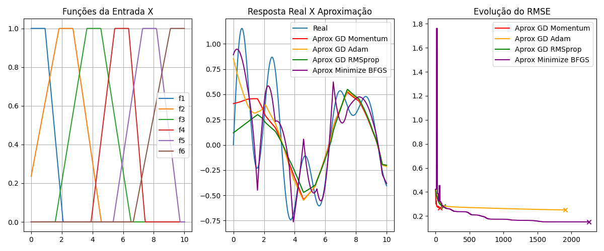

#### 7 Funções de Pertinência

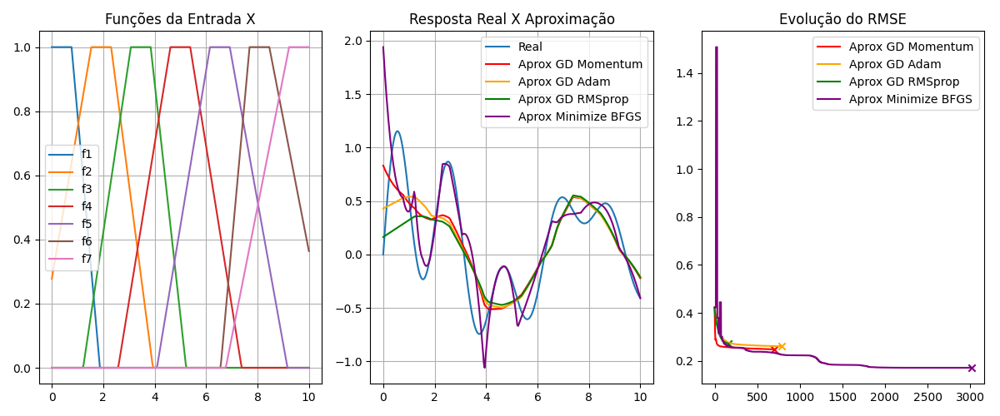

#### 8 Funções de Pertinência

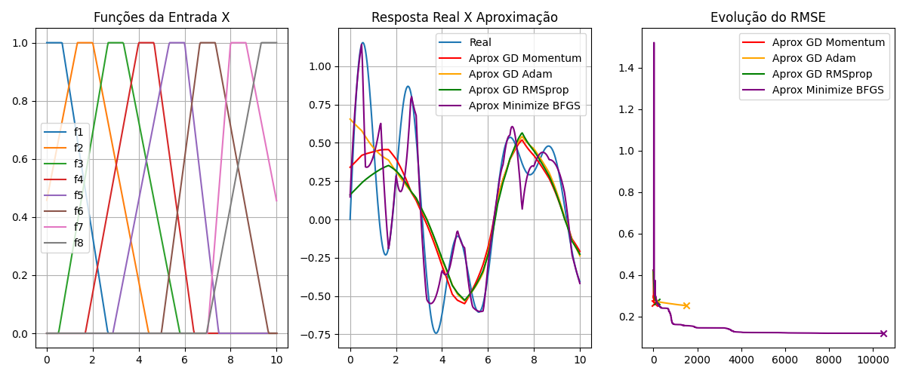

Os gráficos apresentados podem ser interpretados conforme descrito a seguir:

- **Funções de Pertinência da Entrada (à esquerda)**: Exibem as funções de pertinência utilizadas na modelagem, variando conforme o número de funções do domínio.
- **Comparação entre Aproximações e Saída Real (ao centro)**: Apresentam o desempenho do modelo em relação à função alvo, evidenciando o impacto dos métodos de otimização.
- **Evolução do RMSE (à direita)**: Mostra a evolução do erro ao longo das iterações para cada método de otimização aplicado.

**Evolução do RMSE**:

- Com o aumento no número de funções de pertinência, os valores de RMSE tendem a melhorar. No entanto, a partir de 5 funções não há mais melhorias e os erros finais não varia muito, embora alguns métodos de otimização ainda apresentem pequenos avanços pontuais.
- O método de otimização **BFGS** obtém os melhores valores de erro final e, em geral, é o mais lento para convergir. Os outros métodos apresentam erros finais semelhantes, mas há uma diferença significativa no tempo de convergência, sendo o **GD Adam** o mais demorado entre eles.

**Resposta Real X Aproximação**:

- Para 4 funções, as aproximações são razoáveis, com a melhor delas sendo a BFGS. Todas as aproximações ficaram bastante próximas entre si.
- Para 5 funções, as aproximações são razoáveis, com a melhor delas sendo bem boa que é a BFGS. As aproximações GD Adam e GD RMSprop ficaram bastante próximas, enquanto a GD Momentum foi a pior.
- Para 6 funções, as aproximações são razoáveis, com a melhor delas sendo muito boa sendo a BFGS. Todas as aproximações ficaram bastante próximas entre si.
- Para 7 funções, as aproximações são razoáveis, com a melhor delas sendo a BFGS porém ela piorou comparada a anterior. Todas as aproximações ficaram bastante próximas entre si.
- Para 8 funções, as aproximações são razoáveis, sendo as melhores aproximações para as trapezoidais. A melhor aproximação foi a BFGS que ficou muito boa porém com umas grandes discrepâncias. Todas as aproximações ficaram bastante próximas entre si.

### Entrada com Funções de Pertinência Gaussiana

#### 4 Funções de Pertinência

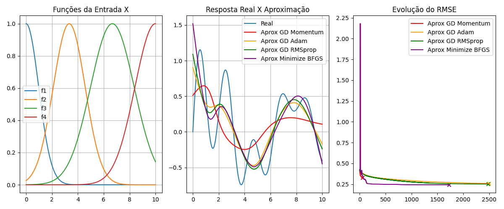

#### 5 Funções de Pertinência

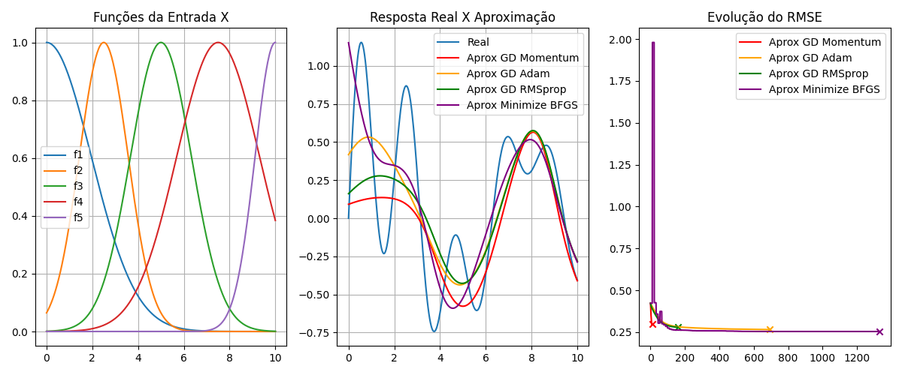

#### 6 Funções de Pertinência


#### 7 Funções de Pertinência

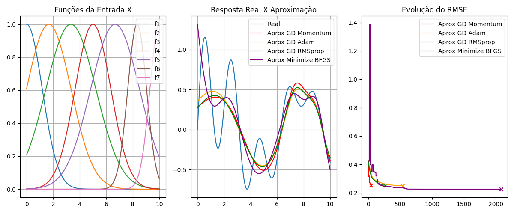

#### 8 Funções de Pertinência

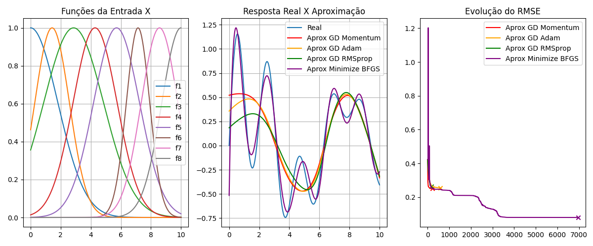

Os gráficos apresentados podem ser interpretados conforme descrito a seguir:

- **Funções de Pertinência da Entrada (à esquerda)**: Exibem as funções de pertinência utilizadas na modelagem, variando conforme o número de funções do domínio.
- **Comparação entre Aproximações e Saída Real (ao centro)**: Apresentam o desempenho do modelo em relação à função alvo, evidenciando o impacto dos métodos de otimização.
- **Evolução do RMSE (à direita)**: Mostra a evolução do erro ao longo das iterações para cada método de otimização aplicado.

**Evolução do RMSE**:

- Com o aumento do número de funções de pertinência, os valores de RMSE não tende a melhorar muito.
- O método de otimização **BFGS** apresenta os melhores valores de erro final, embora seja, em geral, o mais lento para convergir. Os outros métodos têm erros finais semelhantes, mas variam consideravelmente no tempo de convergência, sendo o **GD Adam** o mais demorado deles.

**Resposta Real X Aproximação**:

- Para 4, 5, 6 e 7 funções, as aproximações ficaram razoáveis, sendo a melhor delas em geral a BFGS. Todas as aproximações ficaram bastante próximas entre si, mas as aproximações com 7 funções ligeiramente melhor.
- Para 8 funções, as aproximações são razoáveis, sendo as melhores aproximações para as gaussianas. A melhor aproximação foi a BFGS que ficou bem proxima da real mas tem umas pequenas diferenças. Todas as aproximações ficaram bastante próximas entre si.

### Entrada com Funções de Pertinência Sino

#### 4 Funções de Pertinência


#### 5 Funções de Pertinência


#### 6 Funções de Pertinência


#### 7 Funções de Pertinência


#### 8 Funções de Pertinência

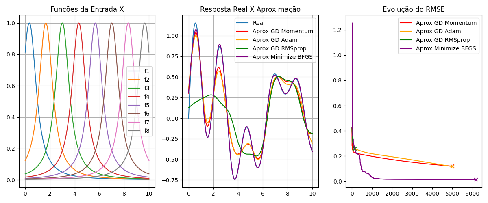

Os gráficos apresentados podem ser interpretados conforme descrito a seguir:

- **Funções de Pertinência da Entrada (à esquerda)**: Exibem as funções de pertinência utilizadas na modelagem, variando conforme o número de funções do domínio.
- **Comparação entre Aproximações e Saída Real (ao centro)**: Apresentam o desempenho do modelo em relação à função alvo, evidenciando o impacto dos métodos de otimização.
- **Evolução do RMSE (à direita)**: Mostra a evolução do erro ao longo das iterações para cada método de otimização aplicado.

**Evolução do RMSE**:

- Com o aumento do número de funções de pertinência, os valores de RMSE não tende a melhorar muito.
- O método de otimização **BFGS** apresenta os melhores valores de erro final, embora seja, em geral, o mais lento para convergir. Os outros métodos têm erros finais semelhantes, mas variam consideravelmente no tempo de convergência, sendo o **GD Adam** o mais demorado deles.

**Resposta Real X Aproximação**:

- Para 4 funções, as aproximações são razoáveis, com a melhor delas sendo a BFGS. Todas as aproximações ficaram bastante diferentes entre si.
- Para 5 funções, as aproximações melhoram um pouco comparada com a anterior mas ainda são rasoáveis. A melhor delas sendo a BFGS, todas as aproximações ficaram mais proximas entre si.
- Para 6 funções, as aproximações melhoram um pouco comparada com a anterior e ficaram boas. A melhor delas sendo a BFGS e a GD Adam é proxima dela, todas as aproximações ficaram bem proximas entre si.
- Para 7 funções, as aproximações melhoram um pouco comparada com a anterior mas aindas são boas. A melhor delas sendo a BFGS e a GD Adam é proxima dela, todas as aproximações ficaram bem proximas entre si.
- Para 8 funções, as aproximações melhoram um pouco comparada com a anterior e ficaram bem boas sendo as melhores para as sinos. A melhor delas sendo a BFGS ficou praticamente igual a real tendo apenas um trecho que não ficou bom. Já as GD Momentum e GD Adam ficaram proximas dela, enquanto a GD RMSprop piorou comparada com a anterior.

### Entrada com Funções de Pertinência Cauchy

#### 4 Funções de Pertinência

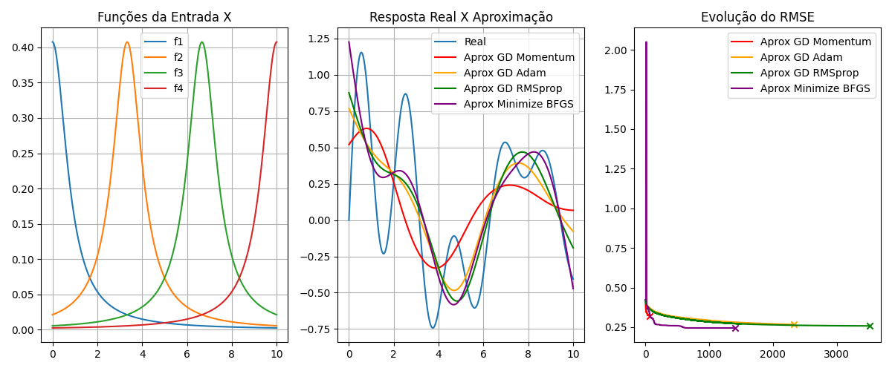

#### 5 Funções de Pertinência

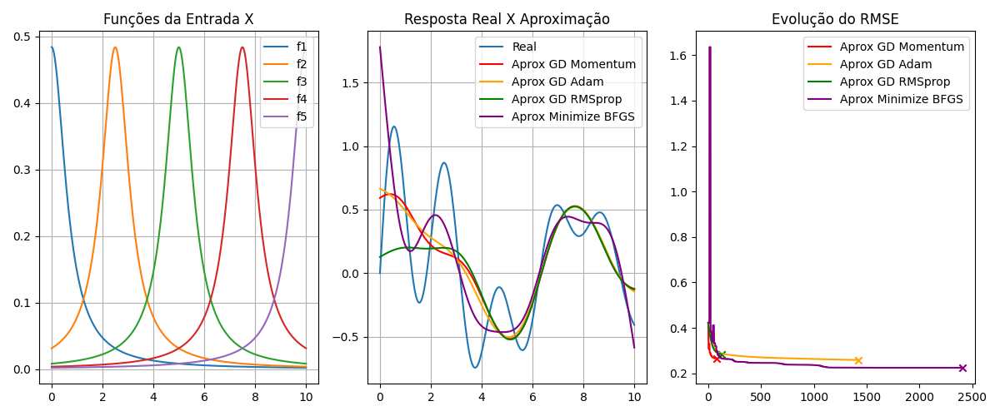

#### 6 Funções de Pertinência

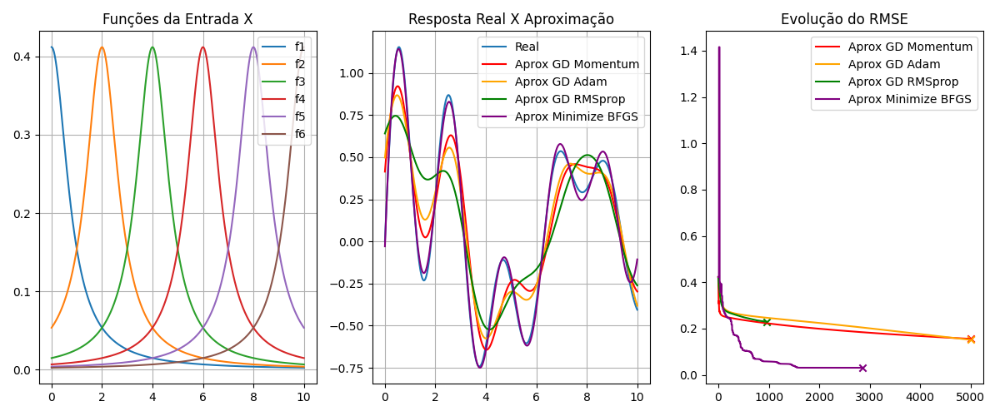

#### 7 Funções de Pertinência


#### 8 Funções de Pertinência

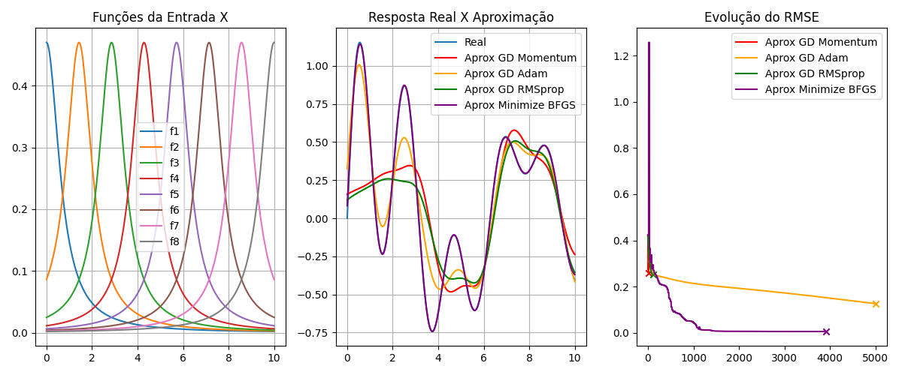

Os gráficos apresentados podem ser interpretados conforme descrito a seguir:

- **Funções de Pertinência da Entrada (à esquerda)**: Exibem as funções de pertinência utilizadas na modelagem, variando conforme o número de funções do domínio.
- **Comparação entre Aproximações e Saída Real (ao centro)**: Apresentam o desempenho do modelo em relação à função alvo, evidenciando o impacto dos métodos de otimização.
- **Evolução do RMSE (à direita)**: Mostra a evolução do erro ao longo das iterações para cada método de otimização aplicado.

**Evolução do RMSE**:

- Com o aumento do número de funções de pertinência, os valores de RMSE não tende a melhorar muito.
- O método de otimização **BFGS** apresenta os melhores valores de erro final, embora seja, em geral, o mais lento para convergir. Os outros métodos têm erros finais semelhantes, mas variam consideravelmente no tempo de convergência, sendo o **GD Adam** o mais demorado deles.

**Resposta Real X Aproximação**:

- Para 4 funções, as aproximações são razoáveis, com a melhor delas sendo a BFGS. Todas as aproximações ficaram bem proximas entre si.
- Para 5 funções, as aproximações melhoram um pouco comparada com a anterior mas ainda são rasoáveis. A melhor delas sendo a BFGS, todas as aproximações ficaram bem proximas entre si.
- Para 6 funções, as aproximações ficaram muito boas sendo as melhores para as Cauchys, mas não é a que tem a melhor aproximação. A melhor delas sendo a BFGS ficou praticamente igual a real tendo apenas um trecho que não ficou bom. Já as GD Momentum e GD Adam ficaram proximas dela, enquanto a GD RMSprop ficou proxima mais não quanto as outras.
- Para 7 e 8 funções, as aproximações ficaram muito boas, sendo a melhor delas a BFGS que visualmente não tem nenhuma diferença da real. A GD Adam ficou proxima da BFGS, enquanto as outras ficaram entre si mas não ficaram tão boas.

### Entrada com Funções de Pertinência Laplace

#### 4 Funções de Pertinência

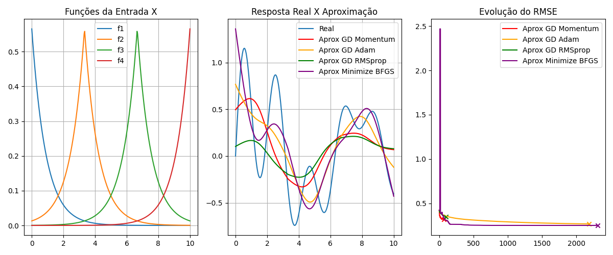

#### 5 Funções de Pertinência


#### 6 Funções de Pertinência


#### 7 Funções de Pertinência


#### 8 Funções de Pertinência


Os gráficos apresentados podem ser interpretados conforme descrito a seguir:

- **Funções de Pertinência da Entrada (à esquerda)**: Exibem as funções de pertinência utilizadas na modelagem, variando conforme o número de funções do domínio.
- **Comparação entre Aproximações e Saída Real (ao centro)**: Apresentam o desempenho do modelo em relação à função alvo, evidenciando o impacto dos métodos de otimização.
- **Evolução do RMSE (à direita)**: Mostra a evolução do erro ao longo das iterações para cada método de otimização aplicado.

**Evolução do RMSE**:

- Com o aumento do número de funções de pertinência, os valores de RMSE não tende a melhorar muito.
- O método de otimização **BFGS** apresenta os melhores valores de erro final, embora seja, em geral, o mais lento para convergir. Os outros métodos têm erros finais semelhantes, mas variam consideravelmente no tempo de convergência, sendo o **GD Adam** o mais demorado deles.

**Resposta Real X Aproximação**:

- Para 4 funções, as aproximações são razoáveis, com a melhor delas sendo a BFGS. Todas as aproximações ficaram bastante diferentes entre si.
- Para 5 funções, as aproximações são razoáveis, com a melhor delas sendo a BFGS. Todas as aproximações ficaram bem proximas entre si.
- Para 6 e 8 funções, as aproximações ficaram bem boas. Sendo a melhor delas a BFGS que ficaram muito parecidas a real mas com umas pequans diferenças, já as outras ficaram entre ficaram proximas delas não ficaram tão boas.
- Para 7 funções, as aproximações ficaram quase perfeitas para todas, sendo a melhor a BFGS mas não por muito. Todas as aproximações ficaram com praticamente o mesmo defieto por isso não são perfeitas. Mas ainda assim, estas aproximações foram as melhores para as Lapplaces e para todos os tipos de funções, sendo as únicas aproximações em que todas ficaram muito boas e muito proximas.

## Resultados Finais

As tabelas a seguir apresentam os valores do RMSE (Root Mean Square Error) para cada método de otimização, avaliados com diferentes tipos e quantidades de funções de pertinência. Os valores menores indicam melhor desempenho.

#### 4 Funções de Pertinência

| Método de Otimização | Triangular | Trapezoidal | Gaussiana |   Sino  |  Cauchy | Laplace |  Total  |
|:--------------------:|:----------:|:-----------:|:---------:|:-------:|:-------:|:-------:|:-------:|
|      GD Momentum     |   0.26487  |   0.31290   |  0.32895  | 0.33094 | 0.32063 | 0.31769 | 1.87598 |
|        GD Adam       |   0.26148  |   0.27123   |  0.25829  | 0.26846 | 0.26677 | 0.26821 | 1.59444 |
|      GD RMSprop      |   0.37095  |   0.25551   |  0.25185  | 0.35008 | 0.25787 | 0.35039 | 1.83665 |
|     Minmize BFGS     |   0.23390  |   0.24358   |  0.24259  | 0.25264 | 0.24481 | 0.25132 | 1.46884 |

#### 5 Funções de Pertinência

| Método de Otimização | Triangular | Trapezoidal | Gaussiana |   Sino  |  Cauchy | Laplace |  Total  |
|:--------------------:|:----------:|:-----------:|:---------:|:-------:|:-------:|:-------:|:-------:|
|      GD Momentum     |   0.26679  |   0.30588   |  0.29777  | 0.27796 | 0.26489 | 0.25473 | 1.66802 |
|        GD Adam       |   0.23720  |   0.27885   |  0.26568  | 0.22236 | 0.25868 | 0.25181 | 1.51458 |
|      GD RMSprop      |   0.25247  |   0.28034   |  0.27910  | 0.29026 | 0.28451 | 0.26279 | 1.64947 |
|     Minmize BFGS     |   0.20746  |   0.19900   |  0.25396  | 0.17571 | 0.22474 | 0.20976 | 1.27063 |

#### 6 Funções de Pertinência

| Método de Otimização | Triangular | Trapezoidal | Gaussiana |   Sino  |  Cauchy | Laplace |  Total  |
|:--------------------:|:----------:|:-----------:|:---------:|:-------:|:-------:|:-------:|:-------:|
|      GD Momentum     |   0.19095  |   0.26745   |  0.25478  | 0.26177 | 0.15557 | 0.22193 | 1.35245 |
|        GD Adam       |   0.20388  |   0.25029   |  0.25548  | 0.15904 | 0.15119 | 0.19049 | 1.21037 |
|      GD RMSprop      |   0.26778  |   0.28144   |  0.26098  | 0.28113 | 0.22919 | 0.25237 | 1.57289 |
|     Minmize BFGS     |   0.13174  |   0.15084   |  0.24762  | 0.09157 | 0.03074 | 0.03412 | 0.68663 |

#### 7 Funções de Pertinência

| Método de Otimização | Triangular | Trapezoidal | Gaussiana |   Sino  |  Cauchy | Laplace |  Total  |
|:--------------------:|:----------:|:-----------:|:---------:|:-------:|:-------:|:-------:|:-------:|
|      GD Momentum     |   0.25756  |   0.24793   |  0.25294  | 0.25650 | 0.25624 | 0.08517 | 1.35634 |
|        GD Adam       |   0.25620  |   0.26037   |  0.25013  | 0.12559 | 0.12447 | 0.07826 | 1.09502 |
|      GD RMSprop      |   0.28012  |   0.27192   |  0.25297  | 0.22694 | 0.27047 | 0.04496 | 1.34738 |
|     Minmize BFGS     |   0.14911  |   0.17113   |  0.22562  | 0.03115 | 0.00650 | 0.03768 | 0.62119 |

#### 8 Funções de Pertinência

| Método de Otimização | Triangular | Trapezoidal | Gaussiana |   Sino  |  Cauchy | Laplace |  Total  |
|:--------------------:|:----------:|:-----------:|:---------:|:-------:|:-------:|:-------:|:-------:|
|      GD Momentum     |   0.26136  |   0.26593   |  0.25063  | 0.11956 | 0.25751 | 0.23307 | 1.38806 |
|        GD Adam       |   0.25099  |   0.25233   |  0.25470  | 0.11616 | 0.12572 | 0.09940 |  1.0993 |
|      GD RMSprop      |   0.19335  |   0.27209   |  0.26343  | 0.25774 | 0.25052 | 0.25177 |  1.4889 |
|     Minmize BFGS     |   0.07042  |   0.11885   |  0.07988  | 0.01470 | 0.00493 | 0.01767 | 0.30645 |

- O menor erro total obtido foi 0.30645, alcançado pelo método Minimize BFGS com 8 funções de pertinência.
- A função Laplace com 7 funções de pertinência apresentou erros inferiores a 0.1 para todos os métodos.

#### Ranking Final (Erro Total Médio)

| Posição |     Método    | Erro Total Médio |
|:-------:|:-------------:|:----------------:|
|    1º   | Minimize BFGS |      0.87075     |
|    2º   |    GD Adam    |      1.30274     |
|    3°   |  GD Momentum  |      1.52817     |
|    4°   |   GD RMSprop  |      1.57906     |